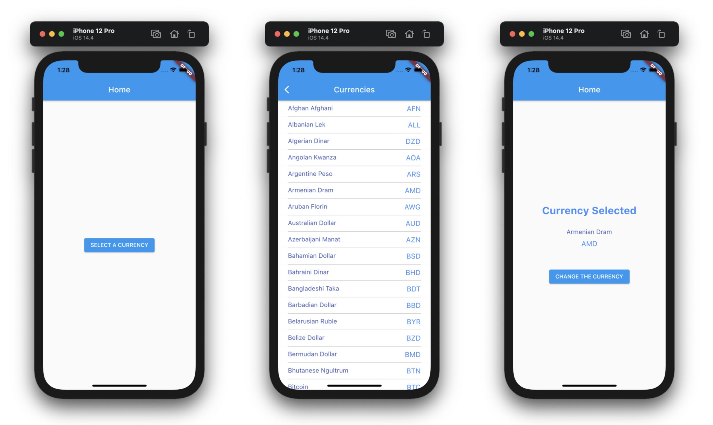

## Currency Converter Demo made with Flutter

### Summary

This is a simple Currency Converter app with some of the most important practices and configurations to develop real and complex cross-platform apps with Flutter. 

### Some Specifications

- Currencies and rates are fetched from https://currencylayer.com/
- To use currencylayer.com free API, an API Access Key is used.
- The User can select a currency from a list of currencies provided by the API.
- The Currencies and Rates are persisted locally and refreshed no more frequently than every 30 minutes.

### Features

- Project Flavours. **Development and Production**.
- Architecture: **State Notifier**. 
- Code Generation: **Freezed**.
- Local Storage:
  - **Share Preferences**
  - **SQFLite**
- Networking: **Retrofit for Dart**

### Links of resources used to develop this Demo

Description | URL
-- | --
gitignore | https://github.com/flutter/flutter/blob/master/.gitignore
Flavors for Flutter | https://flutter.dev/docs/deployment/flavors
state_notifier | https://github.com/rrousselGit/state_notifier
flutter_state_notifier | https://pub.dev/packages/flutter_state_notifier
Code Generator | https://github.com/rrousselGit/freezed
Local Storage - SharedPreferences | https://pub.dev/packages/shared_preferences
Retrofit | https://pub.dev/packages/retrofit
Persist data with SQLite | https://flutter.dev/docs/cookbook/persistence/sqlite

### TODO

- Make it so the User is able to enter the desired amount for the selected currency and the conversion should be reflected for the other currencies.
- Fetch the rates and persist them locally.

----

This demo is a **Work in Progress**.  I will continue updating this project as well as this readme file.